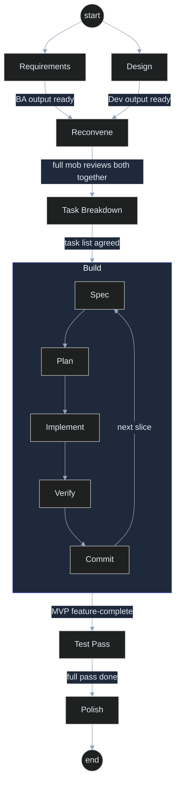

# SDLC Workflow — RW-MVP Workshop

How BA, Dev, and Test hand off to each other across the day. Operational detail behind [Part 04 — Mob Working](../flexible-mob-workshop/workshop/04-mob-working.md).

## Stage flow

| Stage | Lead | Mode | Output (committed to repo) | Handoff trigger |
|---|---|---|---|---|
| Requirements | BA | Breakout OK | `docs/requirements/` | "Requirements ready for design." |
| Design / SAD | Dev | Breakout OK — parallel with Requirements | `docs/design/` | Architecture agreed |
| *(reconvene)* | All | Full mob | — | Both outputs reviewed together |
| Task breakdown | Dev | Full mob | `docs/dev-spec.md` | Task list agreed by mob |
| Build (spec-driven loop, per slice) | Dev + Test | Full mob | Working code + tests | MVP feature-complete |
| Test pass | Test | Breakout OK to draft strategy; full mob to review | `docs/testing/` | "Test pass complete — ready for demo prep." |
| Polish + demo prep | All | Full mob | Stable build, demo script, `docs/token-log.md` | End of day |

Every transition is a one-line update to [`state/current-stage.md`](../state/current-stage.md).

## The inner loop: Spec-Driven Development

Within the **Build** stage, every feature slice runs this loop:

1. **Spec** — describe the behavior and acceptance criteria (with the AI), from `docs/requirements/`.
2. **Plan** — the agent proposes an approach; the mob reviews before coding.
3. **Build** — the agent implements; navigators review each change.
4. **Verify** — run build + tests; fix failures before moving on.
5. **Commit** — small, working commit with a clear message.

Test's persona is active throughout this loop — each slice gets tests as it lands.

## Stage diagram

## Definition of Done (per feature slice)

- [ ] Meets acceptance criteria from `docs/requirements/`
- [ ] Build passes locally
- [ ] Tests written and passing
- [ ] Artifacts updated and committed

## Agent routing quick reference

| Stage | Load this agent | Switch in state/current-stage.md |
|---|---|---|
| Requirements | `.github/agents/ba.agent.md` | `current_stage: requirements` |
| Design | `.github/agents/developer.agent.md` | `current_stage: design` |
| Task breakdown | `.github/agents/developer.agent.md` | `current_stage: task-breakdown` |
| Build | both dev + tester agent files | `current_stage: build` |
| Test pass | `.github/agents/tester.agent.md` | `current_stage: test-pass` |
| Polish | `AGENTS.md` (core agent) | `current_stage: polish` |
